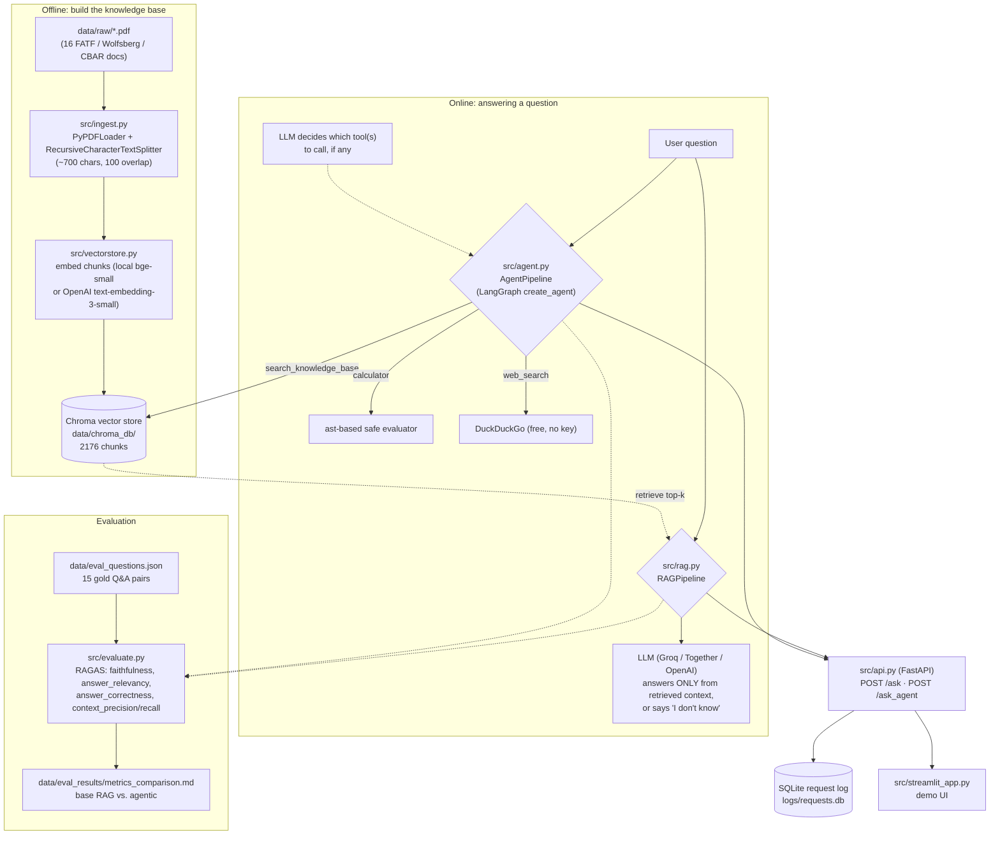

# AI Knowledge Assistant — AML/KYC Compliance RAG

A retrieval-augmented generation (RAG) question-answering service over AML/KYC
(Anti-Money Laundering / Know Your Customer) and financial compliance documents for a
neobank/fintech, with an agentic tool-calling layer and a RAGAS-based evaluation
framework. Built as a portfolio project for a Junior AI Applications & AI Agents
Engineer role.

## What this is

- A **document corpus** of 16 real regulatory PDFs (FATF, the Wolfsberg Group, the
  Central Bank of Azerbaijan, and Azerbaijan's AML/CFT statute) — see
  [`data/raw/SOURCES.md`](data/raw/SOURCES.md).
- A **RAG pipeline** ([`src/rag.py`](src/rag.py)) that retrieves the most relevant
  chunks from a Chroma vector store and answers strictly from that context, refusing
  to answer (rather than hallucinating) when the context is insufficient.
- An **agentic layer** ([`src/agent.py`](src/agent.py)) that decides, per question,
  whether to consult the knowledge base, use a calculator, use live web search, or
  admit it doesn't know — rather than always doing retrieval-then-generate.
- A **FastAPI backend** ([`src/api.py`](src/api.py)) exposing both pipelines behind
  `POST /ask` and `POST /ask_agent`, with every request logged to SQLite.
- A **Streamlit demo UI** ([`src/streamlit_app.py`](src/streamlit_app.py)).
- A **RAGAS evaluation** ([`src/evaluate.py`](src/evaluate.py)) comparing the base RAG
  pipeline against the agentic one on the same 15-question gold set.
- **Docker** packaging for both services (`Dockerfile` + `docker-compose.yml`).

## Domain & corpus

16 PDF documents (~11 MB) covering AML/KYC for a neobank operating in relation to
Azerbaijan: the FATF Recommendations, FATF's 2025 Azerbaijan follow-up report and
beneficial-ownership guidance, 8 Wolfsberg Group guidance/FAQ documents (PEPs,
beneficial ownership, source of wealth/funds, sanctions screening, digital customer
lifecycle, correspondent banking, payment transparency, risk-based approach), and 5
CBAR/Azerbaijani-law documents (the core AML/CFT statute, the Law on Banks, and
payment/e-money institution regulation). Full list with source URLs and retrieval
notes: [`data/raw/SOURCES.md`](data/raw/SOURCES.md).

## Architecture



## Quickstart

### 1. Local (Python)

```bash
python -m venv .venv
source .venv/bin/activate       # .venv\Scripts\activate on Windows
pip install -r requirements.txt
cp .env.example .env            # then fill in an LLM API key (see below)
```

Build the vector index once (takes a few minutes on first run — it downloads the
local embedding model and embeds ~2,200 chunks on CPU):

```bash
python -m src.vectorstore
```

Ask a question from the command line:

```bash
python -m src.rag "What does beneficial ownership mean?"
python -m src.agent "What's 450 times 37?"
```

Or run the API + UI:

```bash
uvicorn src.api:app --reload &
streamlit run src/streamlit_app.py
```

### 2. Docker

```bash
cp .env.example .env   # fill in an LLM API key first
docker compose up --build
```

The API is at `http://localhost:8000` (docs at `/docs`), the UI at
`http://localhost:8501`. The Chroma index is built automatically on first container
start if `data/chroma_db/` is empty.

### Getting an LLM API key

The project defaults to **Groq** (`LLM_PROVIDER=groq` in `.env.example`), which has a
free tier with an OpenAI-compatible API — no other code changes needed:

1. Create a free account at [console.groq.com](https://console.groq.com).
2. Create an API key under **API Keys**.
3. Put it in `.env` as `GROQ_API_KEY=...`.

Together AI and OpenAI both work too — just change `LLM_PROVIDER`, the matching
`*_API_KEY`, and `LLM_MODEL` in `.env` (see the comments in `.env.example`).
**Embeddings need no key at all** by default (`EMBEDDING_PROVIDER=local`, a
sentence-transformers model that runs on CPU).

## What's been run for real vs. what needs your API key

Everything through retrieval was built and verified against the real 16-document
corpus in this environment: ingestion (2,176 chunks), embeddings + Chroma indexing,
and a 7-query retrieval smoke test (all passing — see
[`tests/test_retrieval.py`](tests/test_retrieval.py)). The full test suite (25 tests
across ingestion, retrieval, the agent's tools, and the API contract) passes without
requiring any API key, since the LLM call is the one piece that genuinely can't run
without one.

**No LLM API key was available in the environment this was built in**, so end-to-end
answer generation, the agent's live tool-routing decisions, and the RAGAS metrics
below have not been executed here — the code is real and complete (no stubs), but
those specific numbers need you to add a key and run:

```bash
python -m src.rag --run-eval           # answers all 15 gold questions, saves results
python -m src.evaluate --pipeline both  # computes RAGAS metrics, writes the table below
```

### Example: retrieval in action (no LLM key needed)

```
$ python -m src.rag "What does beneficial ownership mean for AML purposes?"
```
retrieves, as the top chunk:

> [1] (Source: wolfsberg_faqs_beneficial_ownership.pdf, p. 1)
> "...beneficial ownership...is conventionally understood as equating to ultimate
> control over funds in such account, whether through ownership or other means.
> 'Control' in this sense is to be distinguished from mere signature authority or
> legal title..."

which is exactly the passage the gold answer for this question
([`data/eval_questions.json`](data/eval_questions.json):`q01`) is based on — the LLM
step then only needs to phrase that retrieved passage into a direct answer.

### RAGAS metrics: base RAG vs. agentic layer

| Metric | Base RAG | Agentic (RAG + tools) |
|---|---|---|
| faithfulness | *run `python -m src.evaluate` to fill in* | *run `python -m src.evaluate` to fill in* |
| answer_relevancy | — | — |
| answer_correctness | — | — |
| context_precision | — | — |
| context_recall | — | — |

Once populated, this table is written to
[`data/eval_results/metrics_comparison.md`](data/eval_results/) by
`src/evaluate.py` and can be pasted back in here.

## Known limitations

- PDF text extraction occasionally mangles curly quotes/em-dashes from Word-exported
  source PDFs (e.g. `'` renders as `�`) — cosmetic, doesn't affect retrieval quality
  (see the retrieval smoke test), but visible in raw chunk text.
- `langchain-community` is deprecated upstream; it's still used for `PyPDFLoader`
  since that's the stable, documented path and migrating to a standalone loader
  package wasn't warranted for one loader call.
- Two extra FATF documents (Virtual Assets/VASPs risk-based-approach guidance, and
  the original 2023 Azerbaijan Mutual Evaluation Report) couldn't be downloaded
  because `fatf-gafi.org` rate-limits repeated automated requests — noted in
  `data/raw/SOURCES.md` with instructions to add them manually later.

## Tech stack

Python 3.11+, LangChain 1.x / LangGraph (agentic layer), ChromaDB, sentence-transformers
(local embeddings) / OpenAI embeddings, Groq / Together / OpenAI (LLM, OpenAI-compatible),
FastAPI, Streamlit, RAGAS, Docker.

## Project structure

```
data/
  raw/                    16 source PDFs + SOURCES.md
  eval_questions.json     15 gold Q&A pairs (RAGAS evaluation, Step 8)
  agent_test_scenarios.json  10 scenarios: 5 tool-requiring, 5 knowledge-base-only
src/
  ingest.py               PDF loading + chunking
  vectorstore.py          embeddings + Chroma index
  config.py               .env-based configuration
  rag.py                  base RAG pipeline
  agent.py                agentic tool-calling layer
  api.py                  FastAPI backend
  streamlit_app.py        demo UI
  logging_db.py           SQLite request logging
  evaluate.py             RAGAS evaluation
tests/                    25 tests (ingestion, retrieval, agent tools, API contract)
Dockerfile, docker-compose.yml, docker/entrypoint.sh
```

## CV / LinkedIn bullets

- Built a RAG-based AML/KYC compliance assistant over a 16-document, 2,000+ chunk
  regulatory corpus (FATF, Wolfsberg Group, CBAR), using LangChain, ChromaDB, and an
  OpenAI-compatible LLM API (Groq), with citation-grounded answers and an explicit
  "don't know" fallback to avoid hallucinated compliance guidance.
- Designed an agentic tool-calling layer (LangChain/LangGraph) that autonomously
  routes between knowledge-base retrieval, a sandboxed calculator, and live web
  search, validated against 10 hand-written routing scenarios.
- Implemented a RAGAS evaluation framework (faithfulness, answer relevancy, answer
  correctness, context precision/recall) comparing a base RAG pipeline against an
  agentic one on a 15-question gold set distilled directly from source regulations.
- Shipped the assistant as a FastAPI backend with SQLite request logging, a Streamlit
  demo UI, and Docker/docker-compose packaging for reproducible local deployment.

## License

MIT (for the code in this repository). The bundled source documents in `data/raw/`
remain the property of their respective publishers (FATF, the Wolfsberg Group, the
Central Bank of the Republic of Azerbaijan, UNODC); see
[`data/raw/SOURCES.md`](data/raw/SOURCES.md) for attribution and original URLs.
