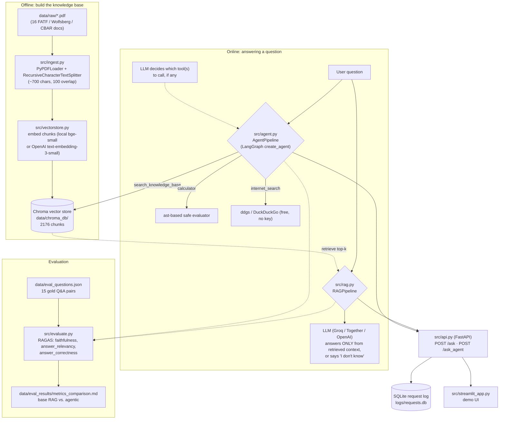

# AI Knowledge Assistant — AML/KYC Compliance RAG

A retrieval-augmented generation (RAG) question-answering service over AML/KYC
(Anti-Money Laundering / Know Your Customer) and financial compliance documents for a
neobank/fintech, with an agentic tool-calling layer and a RAGAS-based evaluation
framework. Built as a portfolio project for a Junior AI Applications & AI Agents
Engineer role.

## What this is

- A **document corpus** of 16 real regulatory PDFs (FATF, the Wolfsberg Group, the
  Central Bank of Azerbaijan, and Azerbaijan's AML/CFT statute) — see
  [`data/raw/SOURCES.md`](data/raw/SOURCES.md).
- A **RAG pipeline** ([`src/rag.py`](src/rag.py)) that retrieves the most relevant
  chunks from a Chroma vector store and answers strictly from that context, refusing
  to answer (rather than hallucinating) when the context is insufficient.
- An **agentic layer** ([`src/agent.py`](src/agent.py)) that decides, per question,
  whether to consult the knowledge base, use a calculator, use live web search, or
  admit it doesn't know — rather than always doing retrieval-then-generate.
- A **FastAPI backend** ([`src/api.py`](src/api.py)) exposing both pipelines behind
  `POST /ask` and `POST /ask_agent`, with every request logged to SQLite.
- A **Streamlit demo UI** ([`src/streamlit_app.py`](src/streamlit_app.py)).
- A **RAGAS evaluation** ([`src/evaluate.py`](src/evaluate.py)) comparing the base RAG
  pipeline against the agentic one on the same 15-question gold set.
- **Docker** packaging for both services (`Dockerfile` + `docker-compose.yml`).

## Domain & corpus

16 PDF documents (~11 MB) covering AML/KYC for a neobank operating in relation to
Azerbaijan: the FATF Recommendations, FATF's 2025 Azerbaijan follow-up report and
beneficial-ownership guidance, 8 Wolfsberg Group guidance/FAQ documents (PEPs,
beneficial ownership, source of wealth/funds, sanctions screening, digital customer
lifecycle, correspondent banking, payment transparency, risk-based approach), and 5
CBAR/Azerbaijani-law documents (the core AML/CFT statute, the Law on Banks, and
payment/e-money institution regulation). Full list with source URLs and retrieval
notes: [`data/raw/SOURCES.md`](data/raw/SOURCES.md).

## Architecture



## Quickstart

### 1. Local (Python)

```bash
python -m venv .venv
source .venv/bin/activate       # .venv\Scripts\activate on Windows
pip install -r requirements.txt
cp .env.example .env            # then fill in an LLM API key (see below)
```

Build the vector index once (takes a few minutes on first run — it downloads the
local embedding model and embeds ~2,200 chunks on CPU):

```bash
python -m src.vectorstore
```

Ask a question from the command line:

```bash
python -m src.rag "What does beneficial ownership mean?"
python -m src.agent "What's 450 times 37?"
```

Or run the API + UI:

```bash
uvicorn src.api:app --reload &
streamlit run src/streamlit_app.py
```

### 2. Docker

```bash
cp .env.example .env   # fill in an LLM API key first
docker compose up --build
```

The API is at `http://localhost:8000` (docs at `/docs`), the UI at
`http://localhost:8501`. The Chroma index is built automatically on first container
start if `data/chroma_db/` is empty.

### Getting an LLM API key

The project defaults to **Groq** (`LLM_PROVIDER=groq` in `.env.example`), which has a
free tier with an OpenAI-compatible API — no other code changes needed:

1. Create a free account at [console.groq.com](https://console.groq.com).
2. Create an API key under **API Keys**.
3. Put it in `.env` as `GROQ_API_KEY=...`.

Together AI and OpenAI both work too — just change `LLM_PROVIDER`, the matching
`*_API_KEY`, and `LLM_MODEL` in `.env` (see the comments in `.env.example`).
**Embeddings need no key at all** by default (`EMBEDDING_PROVIDER=local`, a
sentence-transformers model that runs on CPU).

Groq retires/renames chat models over time, so `LLM_MODEL` may need updating —
if you get a `404 model_not_found`, check your account's current model list at
console.groq.com and update `LLM_MODEL` in `.env`. As of writing this project
defaults to `openai/gpt-oss-120b`; `openai/gpt-oss-20b` and `qwen/qwen3.8-27b`
are also available. If a model's output ever breaks RAGAS's scoring (see
below), point `EVAL_LLM_MODEL` at a different model just for the judge,
without changing which model answers questions.

## What's been run for real vs. what needs your API key

Everything through retrieval was built and verified against the real 16-document
corpus in this environment: ingestion (2,176 chunks), embeddings + Chroma indexing,
and a 7-query retrieval smoke test (all passing — see
[`tests/test_retrieval.py`](tests/test_retrieval.py)). The full test suite (25 tests
across ingestion, retrieval, the agent's tools, and the API contract) passes without
requiring any API key, since the LLM call is the one piece that genuinely can't run
without one.

**No LLM API key was available in the environment this was built in**, so end-to-end
answer generation, the agent's live tool-routing decisions, and the RAGAS metrics
below have not been executed here — the code is real and complete (no stubs), but
those specific numbers need you to add a key and run:

```bash
python -m src.rag --run-eval           # answers all 15 gold questions, saves results
python -m src.evaluate --pipeline both  # computes RAGAS metrics, writes the table below
```

### Example: retrieval in action (no LLM key needed)

```
$ python -m src.rag "What does beneficial ownership mean for AML purposes?"
```
retrieves, as the top chunk:

> [1] (Source: wolfsberg_faqs_beneficial_ownership.pdf, p. 1)
> "...beneficial ownership...is conventionally understood as equating to ultimate
> control over funds in such account, whether through ownership or other means.
> 'Control' in this sense is to be distinguished from mere signature authority or
> legal title..."

which is exactly the passage the gold answer for this question
([`data/eval_questions.json`](data/eval_questions.json):`q01`) is based on — the LLM
step then only needs to phrase that retrieved passage into a direct answer.

### RAGAS metrics: base RAG vs. agentic layer

Judge: `openai/gpt-oss-120b` via Groq, same judge for both columns; local
`bge-small` embeddings; 15 gold questions; `answer_relevancy` uses
`strictness=1` (see Lessons learned).

| Metric | Base RAG | Agentic (RAG + tools) |
|---|---|---|
| faithfulness | 0.619 | *pending — see below* |
| answer_relevancy | 0.612 | *pending* |
| answer_correctness | 0.424 | *pending* |

**Base RAG numbers are real measurements** (15/15 questions scored). Read them
with this in mind: on **5 of the 15 questions (q02, q05, q07, q10, q14) the base
pipeline answered "I don't know based on the available documents" even though
the answer is in the corpus** (retrieval with top-k=4 didn't surface the right
chunk for those questions). RAGAS correctly scores a refusal as 0 for
faithfulness and relevancy, which pulls both averages down: on the 10 questions
it actually answered, faithfulness is 0.93 and relevancy 0.92. That is the
honest picture — the refusal behaviour is safe (no hallucination) but costs
recall, and improving retrieval (larger k, hybrid search, re-ranking) is the
obvious next step.

**The agentic column is not filled in yet.** An earlier attempt to score the
agent was invalid and was discarded: Groq's free-tier daily token quota ran out
while the agent's answers were being generated, the agent's graceful fallback
message ("I couldn't complete this request") was cached as if it were an answer,
and scoring it produced meaningless near-zero numbers. That is fixed (a failed
agent run now raises instead of being cached), but it means the agent's answers
have to be regenerated (only q01 is a real cached answer) *and* scored -- more
judge tokens than one free-tier day allows, so expect to run the command below
on two or three separate days; both answers and scores are cached per question,
so each run resumes where the previous one stopped:

```bash
EVAL_LLM_MODEL=openai/gpt-oss-120b python -m src.evaluate --pipeline agent
```

(use the same judge model as the base-RAG column so the two are comparable;
on Windows PowerShell set `$env:EVAL_LLM_MODEL="openai/gpt-oss-120b"` first),
then fill in the right-hand column from `data/eval_results/agent_ragas_results.json`.

## Lessons learned / debugging notes

Running this against a real Groq key (rather than just importing against mocks)
surfaced a few issues that are worth noting for anyone hitting the same thing:

- **Decommissioned default model.** The original default, `llama-3.3-70b-versatile`,
  returned `404 model_not_found` on Groq. Provider-hosted "serverless" model
  catalogs change over time independently of this repo's code — if a model
  disappears, check the provider's current list and update `LLM_MODEL` in
  `.env` (and the default in `src/config.py` if it should change for everyone).
- **Tool-name collision with a model's own built-in tools.** With the web-search
  tool named `web_search`, `openai/gpt-oss-120b` called it with arguments shaped
  like `{"cursor": 2, "id": 0}` — the schema of gpt-oss's *own* built-in browsing
  tool, not ours — causing Groq to reject the call (`400 tool_use_failed`).
  Renaming it to `internet_search` and explicitly documenting in the tool's
  docstring that it takes a single plain `query: str` argument (not structured
  browser-style arguments) fixed it. Lesson: a tool name/shape that happens to
  match a model's own built-in tool can get silently confused with it.
- **`duckduckgo_search` → `ddgs`.** The package was renamed upstream; the old
  name now just emits a deprecation warning and re-exports the new one, but the
  search results themselves had also started coming back empty or
  locale-irrelevant (e.g. a login page for an unrelated local business) for
  some queries. Migrating the import to `ddgs` and passing `region="us-en"`
  fixed both the deprecation warning and the irrelevant-results problem.

(A few more issues came up in the same debugging session — the agent not
knowing the current date, an occasional runaway search loop, one bad tool call
being able to crash a whole batch evaluation run, and the model's citation
format not matching the prompt's — all fixed in `src/agent.py` and
`src/rag.py`; see their docstrings and inline comments for details.)

Running the actual RAGAS evaluation (`python -m src.evaluate --pipeline both`)
against Groq surfaced two more, specific to using a non-OpenAI judge model:

- **`answer_relevancy` requests `n=3`; Groq allows only `n=1`.** RAGAS's
  `AnswerRelevancy` metric generates 3 reverse-engineered questions per answer
  in a single call (`strictness=3`, passed as `n=3` to the LLM) to average
  over for robustness -- Groq rejects any `n>1` outright
  (`'n': number must be at most 1`). Fixed by constructing the metric with
  `strictness=1` in `src/evaluate.py`. This is a real tradeoff (one sampled
  question instead of three averaged), not a cosmetic workaround, and is
  purely a Groq-API constraint -- it wouldn't come up against OpenAI directly.
- **The judge ran out of output tokens mid-answer** (`LLMDidNotFinishException:
  generation was not completed`). Reasoning models like gpt-oss spend part of
  their output budget on internal reasoning before the actual answer, and
  ragas's default token budget assumption didn't leave enough room. Fixed by
  passing a higher explicit `max_tokens` (4096) for the judge LLM specifically
  (`src/rag.get_llm(..., max_tokens=...)`), without changing the model that
  answers questions.

Separately (not a bug, a capacity constraint worth knowing about): a full
full evaluation of one pipeline cost roughly 100-200k judge tokens, i.e.
**all of Groq's free-tier token quota (200k TPD, a rolling window per model)**
-- with the original five metrics it exhausted the quota before finishing a
single pipeline, so the two context metrics were dropped and only the three the
brief asks for are computed. Once the cap is hit, every further call 429s, and
ragas records `NaN` for those rather than crashing (`raise_exceptions=False`,
the default). Scoring is therefore done one question at a time with a per-question
cache (`data/eval_results/*_scores_cache.json`): only fully-scored questions are
cached, a run stops early after two consecutive questions with no scores, and a
re-run resumes where it stopped. (Also: `qwen/qwen3.8-27b` is unusable as a
judge on the free tier -- its 1,000 output-tokens-per-minute cap rejects any
request asking for `max_tokens=4096`.) The
evaluator's own retry layer is deliberately capped low (`RunConfig(max_retries=2)`
rather than ragas's default 10) specifically so hitting this doesn't also
balloon into dozens of doomed retry attempts per metric on top of the LLM
client's own 5 retries. If you hit this: switch `EVAL_LLM_MODEL` to a smaller
model (e.g. `openai/gpt-oss-20b`), evaluate `--pipeline rag` and
`--pipeline agent` as two separate runs (possibly on different days), or
upgrade the Groq account tier.

## Known limitations

- PDF text extraction occasionally mangles curly quotes/em-dashes from Word-exported
  source PDFs (e.g. `'` renders as `�`) — cosmetic, doesn't affect retrieval quality
  (see the retrieval smoke test), but visible in raw chunk text.
- `langchain-community` is deprecated upstream; it's still used for `PyPDFLoader`
  since that's the stable, documented path and migrating to a standalone loader
  package wasn't warranted for one loader call.
- Two extra FATF documents (Virtual Assets/VASPs risk-based-approach guidance, and
  the original 2023 Azerbaijan Mutual Evaluation Report) couldn't be downloaded
  because `fatf-gafi.org` rate-limits repeated automated requests — noted in
  `data/raw/SOURCES.md` with instructions to add them manually later.

## Tech stack

Python 3.11+, LangChain 1.x / LangGraph (agentic layer), ChromaDB, sentence-transformers
(local embeddings) / OpenAI embeddings, Groq / Together / OpenAI (LLM, OpenAI-compatible),
FastAPI, Streamlit, RAGAS, Docker.

## Project structure

```
data/
  raw/                    16 source PDFs + SOURCES.md
  eval_questions.json     15 gold Q&A pairs (RAGAS evaluation, Step 8)
  agent_test_scenarios.json  10 scenarios: 5 tool-requiring, 5 knowledge-base-only
src/
  ingest.py               PDF loading + chunking
  vectorstore.py          embeddings + Chroma index
  config.py               .env-based configuration
  rag.py                  base RAG pipeline
  agent.py                agentic tool-calling layer
  api.py                  FastAPI backend
  streamlit_app.py        demo UI
  logging_db.py           SQLite request logging
  evaluate.py             RAGAS evaluation
tests/                    25 tests (ingestion, retrieval, agent tools, API contract)
Dockerfile, docker-compose.yml, docker/entrypoint.sh
```

## CV / LinkedIn bullets

- Built a RAG-based AML/KYC compliance assistant over a 16-document, 2,000+ chunk
  regulatory corpus (FATF, Wolfsberg Group, CBAR), using LangChain, ChromaDB, and an
  OpenAI-compatible LLM API (Groq), with citation-grounded answers and an explicit
  "don't know" fallback to avoid hallucinated compliance guidance.
- Designed an agentic tool-calling layer (LangChain/LangGraph) that autonomously
  routes between knowledge-base retrieval, a sandboxed calculator, and live web
  search, with 10 hand-written routing test scenarios.
- Implemented a RAGAS evaluation framework (faithfulness, answer relevancy, answer
  correctness) comparing a base RAG pipeline against an
  agentic one on a 15-question gold set distilled directly from source regulations.
- Shipped the assistant as a FastAPI backend with SQLite request logging, a Streamlit
  demo UI, and Docker/docker-compose packaging for reproducible local deployment.

## License

MIT (for the code in this repository). The bundled source documents in `data/raw/`
remain the property of their respective publishers (FATF, the Wolfsberg Group, the
Central Bank of the Republic of Azerbaijan, UNODC); see
[`data/raw/SOURCES.md`](data/raw/SOURCES.md) for attribution and original URLs.
