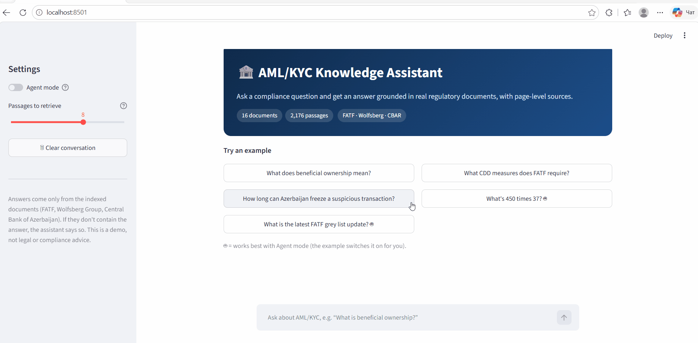
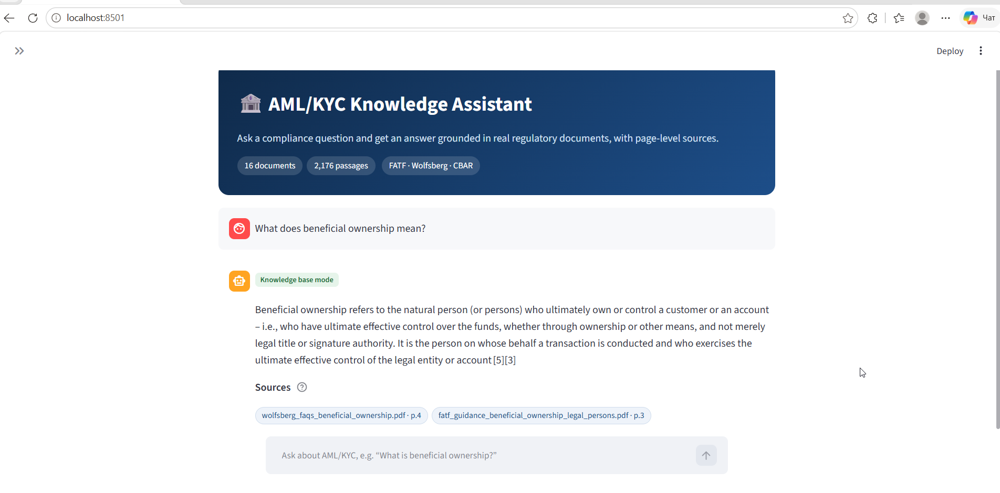
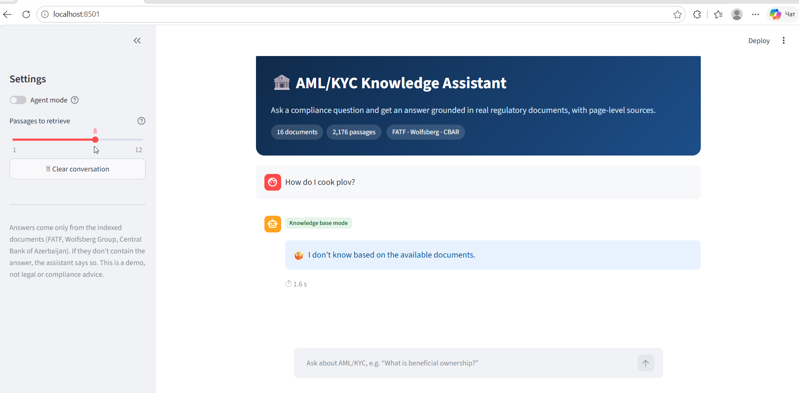
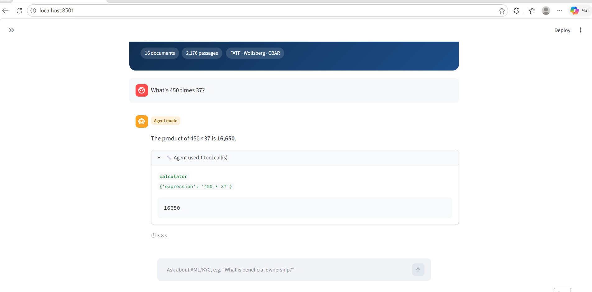
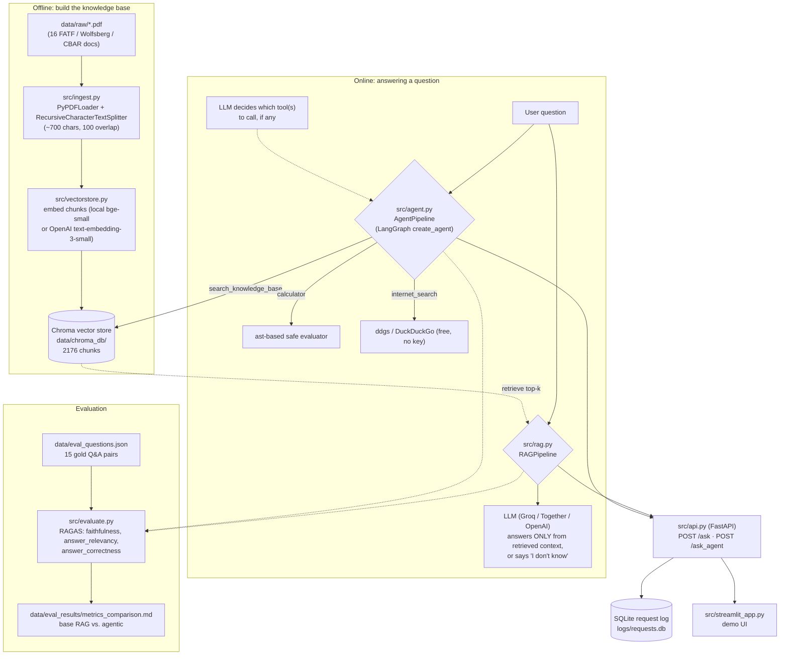
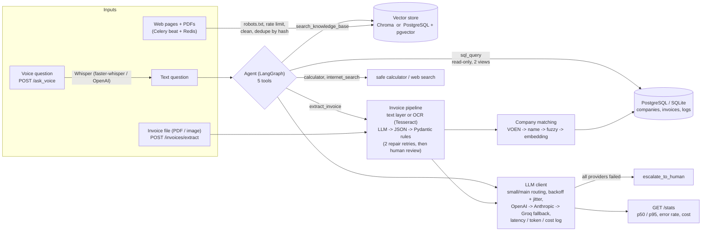

# AI Knowledge Assistant — AML/KYC Compliance RAG

[](https://github.com/emiliaismailova3/aml-kyc-rag-assistant/actions/workflows/tests.yml)


Ask a compliance question and get an answer **grounded in real regulatory documents**
(FATF, Wolfsberg Group, Central Bank of Azerbaijan), with every claim linked to a
numbered source and page. When the documents don't contain the answer, it says
"I don't know" instead of making one up. An optional **agent** can also use a
calculator and live web search, and quality is **measured with RAGAS**, not just demoed.



## At a glance

- **RAG over 16 regulatory PDFs** (2,176 chunks) with local embeddings (no API key),
  ChromaDB, and any OpenAI-compatible LLM (Groq / Together / OpenAI) chosen in `.env`.
- **Citation-linked answers**: `[3]` in the answer maps to the `[3] file.pdf · p.12`
  source chip; only passages the answer actually cites are shown.
- **Tool-calling agent** (LangChain / LangGraph) that chooses between knowledge-base
  search, a sandboxed calculator and web search, with a step limit against loops.
- **FastAPI** backend with SQLite request logging, **Streamlit** UI, **Docker Compose**.
- **Document-assistant extensions** (invoice extraction, company matching, pgvector, SQL agent tool, scheduled collection, voice, LLM reliability layer): see [Document-assistant extensions](#document-assistant-extensions) and the honest [status table](docs/STATUS.md).
- **224 automated tests + lint + Docker smoke test** in CI on every push.
- **RAGAS evaluation** (faithfulness, answer relevancy, answer correctness) on a
  15-question gold set, with the failure cases diagnosed — see [Results](#results).

## Quickstart

```bash
python -m venv .venv && source .venv/bin/activate   # .venv\Scripts\activate on Windows
pip install -r requirements.txt
cp .env.example .env            # add a free GROQ_API_KEY (see below)
python -m src.vectorstore       # build the index once (a few minutes on CPU)
```

Then either ask from the command line:

```bash
python -m src.rag "What does beneficial ownership mean?"
python -m src.rag --retrieve-only "What does beneficial ownership mean?"   # no API key needed
python -m src.agent "What's 450 times 37?"
```

or start the API and the UI (two terminals):

```bash
uvicorn src.api:app            # API at http://localhost:8000, docs at /docs
streamlit run src/streamlit_app.py   # UI at http://localhost:8501
```

**With Docker** (builds the index automatically on first start):

```bash
cp .env.example .env            # add your API key
docker compose up --build       # API on :8000, UI on :8501
```

**Getting a free LLM key.** The default provider is Groq: create an account at
[console.groq.com](https://console.groq.com), create a key under *API Keys*, and put it
in `.env` as `GROQ_API_KEY=...`. Together AI and OpenAI also work — change
`LLM_PROVIDER`, the matching `*_API_KEY` and `LLM_MODEL` (see `.env.example`).
Providers retire models over time; if you get `404 model_not_found`, pick a current
model from your provider's list and set `LLM_MODEL`.

## Screenshots

| Answer with page-level sources | Honest refusal | Agent mode (tool call visible) |
|---|---|---|
|  |  |  |

## How it works



- **Ingestion** ([`src/ingest.py`](src/ingest.py)): every PDF page is split into
  ~700-character chunks (100 overlap); each chunk keeps its file name, page number and
  a stable `chunk_id`, so any answer can be traced back to *file, page N*.
- **Base RAG** ([`src/rag.py`](src/rag.py)): retrieves the top 8 chunks, numbers them
  `[1]…[8]` in the prompt, and instructs the model to answer only from them, cite by
  number, or reply exactly *"I don't know based on the available documents."*
  The cited numbers are then mapped back to their documents.
- **Agent** ([`src/agent.py`](src/agent.py)): decides per question whether to search
  the knowledge base, use the calculator (an `ast`-based evaluator — no `eval`, capped
  exponents), search the web, or admit it doesn't know. Today's date is injected so
  "latest" means today; the model is told to stop after 2 web searches, and a hard
  step limit ends any loop that ignores that.
- **API** ([`src/api.py`](src/api.py)): `POST /ask` and `POST /ask_agent` with the same
  response shape; provider rate limits come back as a clear `429`, not a bare `500`.

## Document-assistant extensions

On top of the RAG core, this branch adds the pieces of a small "document assistant" for a
fintech/factoring setting. **Honest status of every piece is in [`docs/STATUS.md`](docs/STATUS.md)**;
design choices are in [`docs/DECISIONS.md`](docs/DECISIONS.md); plain-language walkthroughs (Russian)
with interview questions are in [`docs/learn/`](docs/learn/00-overview.md).



| Feature | Run it | What was actually verified |
|---|---|---|
| pgvector backend (`VECTOR_BACKEND=pgvector`) | `docker compose --profile full up -d postgres` then `python -m src.vectorstore` | 2,176 chunks indexed with an HNSW cosine index and queried; integration tests against real PostgreSQL |
| Invoice extraction | `python -m src.invoices.evaluate --kinds text` | **5/5 text-layer PDFs correct on all 6 fields.** The 10 scan/image invoices need Tesseract, which was **not installed**, so OCR accuracy is **unmeasured** |
| Company matching | `python -m src.matching.evaluate` | 52 labeled synthetic pairs: precision 1.0, recall 1.0, 3 near-miss names sent to human review |
| Reliability layer + `/stats` | `curl localhost:8000/stats` | Retry/fallback/routing covered by tests with scripted providers; **live-tested on Groq only** (no OpenAI/Anthropic key was available) |
| Agent SQL + invoice tools | `python -m scripts.seed_demo_db && python -m scripts.check_agent_routing` | 6/6 routing scenarios with correct answers on SQLite; 3/3 SQL scenarios on PostgreSQL via the read-only role |
| Scheduled collection | `celery -A src.collector.tasks worker --pool=solo` | Real Redis + worker: 2 pages ingested, the second run reported duplicates and added nothing |
| Voice questions | `curl -F "file=@q.wav" localhost:8000/ask_voice` | Speech-to-text pipeline runs; **recognition accuracy is unmeasured** |

**Limitations to know about:** all invoice and company data is synthetic and fictional; the agent has no
provider fallback (it logs through a callback); the Anthropic/OpenAI fallback is tested with mocks only;
the SQL tool rejects `WITH`/`UNION` queries; the RAGAS table above was measured on the Chroma backend and the agent
has not been re-scored with the new tools.

## Results

RAGAS on the 15-question gold set ([`data/eval_questions.json`](data/eval_questions.json));
judge `openai/gpt-oss-120b` via Groq, local `bge-small` embeddings.

| Metric | Base RAG, top-k=4 (all 15 questions) | Base RAG, top-k=4 (10 answered) |
|---|---|---|
| faithfulness | 0.619 | 0.93 |
| answer_relevancy | 0.612 | 0.92 |
| answer_correctness | 0.424 | — |

**What the numbers say.** When the pipeline answers, the answer is almost always
supported by the retrieved text (0.93 faithfulness). The weak spot is **recall**: it
refused 5 of 15 questions whose answers *are* in the corpus, and RAGAS scores a
refusal as 0, which pulls the overall averages down.

**Diagnosis and fix.** For every refused question the right *document* ranked first,
but the passage with the answer sat just below the top 4 chunks (e.g. the FATF CDD
passage ranked 8th). Raising the default to **top-k=8** fixed 2 of the 5 refusals in a
spot check (q02, q05). One question (q10) never surfaces its passage in the top 20,
which points to a PDF text-extraction issue rather than ranking.

**Next steps:** re-score base RAG at k=8 and score the agentic pipeline on the same
set (`python -m src.evaluate --pipeline both`; the run is resumable because Groq's free
tier allows roughly one pipeline per day), then try hybrid BM25 + vector search and a
re-ranker for the remaining misses. Engineering notes from the evaluation, including
Groq-specific RAGAS issues, are in [`docs/NOTES.md`](docs/NOTES.md).

## Testing

```bash
python -m src.vectorstore        # retrieval tests query the real index
pytest -k "not internet_search"  # 224 tests; no LLM key needed (LLM calls are mocked)
ruff check src tests
```

Tests marked `postgres` / `redis` need `docker compose --profile full up -d postgres redis` and are
skipped automatically when those services are not reachable (all 224 passed locally with them running).

CI ([`.github/workflows/tests.yml`](.github/workflows/tests.yml)) runs the tests and
lint, then builds the Docker image and boots API + UI with `docker compose up --wait`
and checks both health endpoints.

Covered: ingestion and chunk metadata, retrieval quality (7 queries, right document
in the top 3), citation-to-source mapping, the calculator's rejection of code
injection and oversized expressions, the API contract and error mapping, the
Streamlit UI (via `AppTest`), and the evaluation's resume/caching logic.

## Known limitations

- The agent's answers haven't been scored by RAGAS yet (see *Next steps*), and the
  base-RAG table is the k=4 baseline.
- PDF extraction occasionally mangles curly quotes in Word-exported PDFs (`'` → `�`);
  cosmetic, retrieval isn't affected.
- Two FATF documents (VASP guidance, 2023 Azerbaijan Mutual Evaluation Report)
  couldn't be downloaded automatically because of rate limiting; see
  [`data/raw/SOURCES.md`](data/raw/SOURCES.md).
- This is a portfolio demo, not legal or compliance advice.

## Project structure

```
data/
  raw/                       16 source PDFs + SOURCES.md (URLs, retrieval dates)
  eval_questions.json        15 gold Q&A pairs for RAGAS
  agent_test_scenarios.json  10 routing scenarios (5 need tools, 5 knowledge-base only)
src/
  ingest.py         PDF loading + chunking
  vectorstore.py    embeddings + Chroma index (cached per process)
  config.py         .env-based configuration
  rag.py            base RAG pipeline + citation-to-source mapping
  agent.py          tool-calling agent (knowledge base, calculator, web search)
  api.py            FastAPI backend
  streamlit_app.py  demo UI
  logging_db.py     SQLite request logging
  evaluate.py       RAGAS evaluation (resumable)
  llm_client.py     LLM wrapper: routing, retry, fallback chain, cost logging
  db.py, pgvector_store.py   SQLAlchemy tables and the PostgreSQL + pgvector backend
  sql_tool.py       read-only SQL guard for the agent
  invoices/         OCR / text layer, LLM extraction, validation, evaluation
  matching/         company-name matching and its evaluation
  collector/        Celery tasks: fetch, clean, dedupe, ingest
  voice.py          speech-to-text for /ask_voice
tests/              224 tests
docs/               demo GIF, screenshots, engineering notes
Dockerfile, docker-compose.yml, docker/entrypoint.sh
```

## Tech stack

Python 3.11+, LangChain 1.x / LangGraph, ChromaDB, sentence-transformers
(`BAAI/bge-small-en-v1.5`), Groq / Together / OpenAI (OpenAI-compatible API), FastAPI,
Streamlit, RAGAS, pytest, ruff, Docker, GitHub Actions.

## License

MIT for the code in this repository. The documents in `data/raw/` remain the property
of their publishers (FATF, the Wolfsberg Group, the Central Bank of the Republic of
Azerbaijan, UNODC); see [`data/raw/SOURCES.md`](data/raw/SOURCES.md) for attribution.
