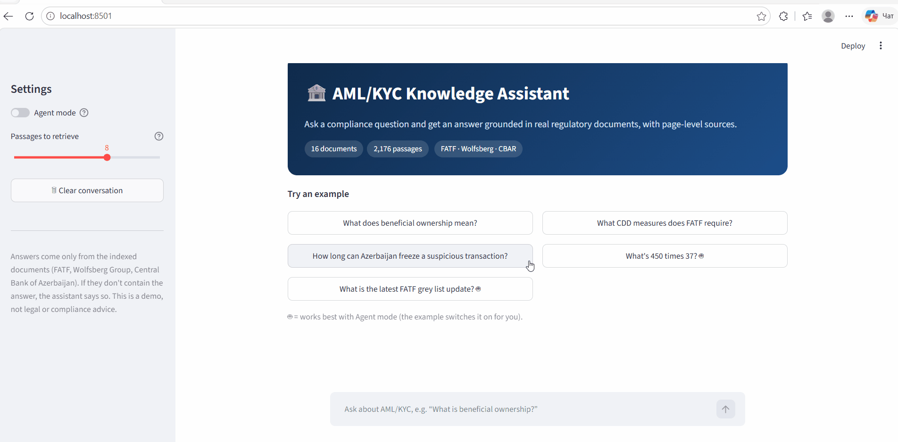
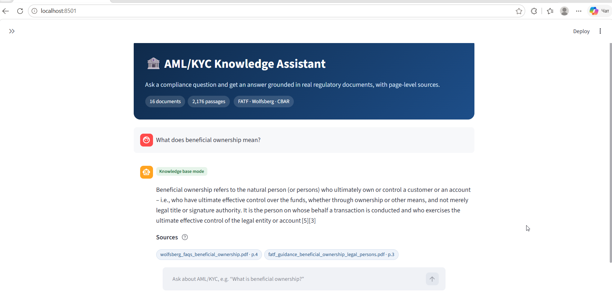
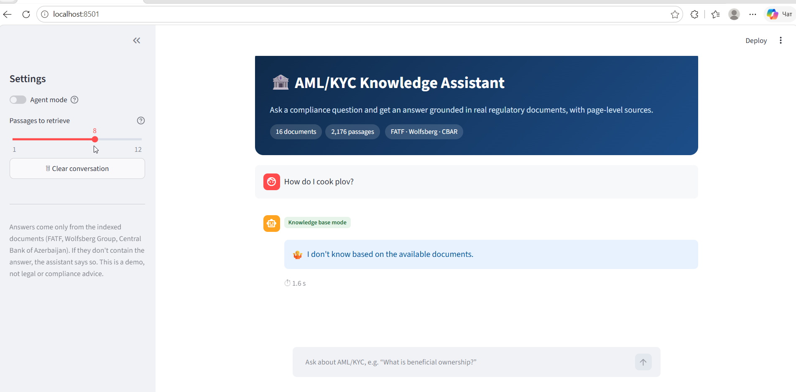
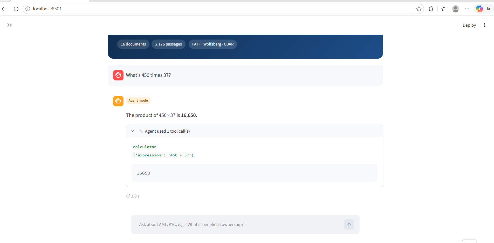
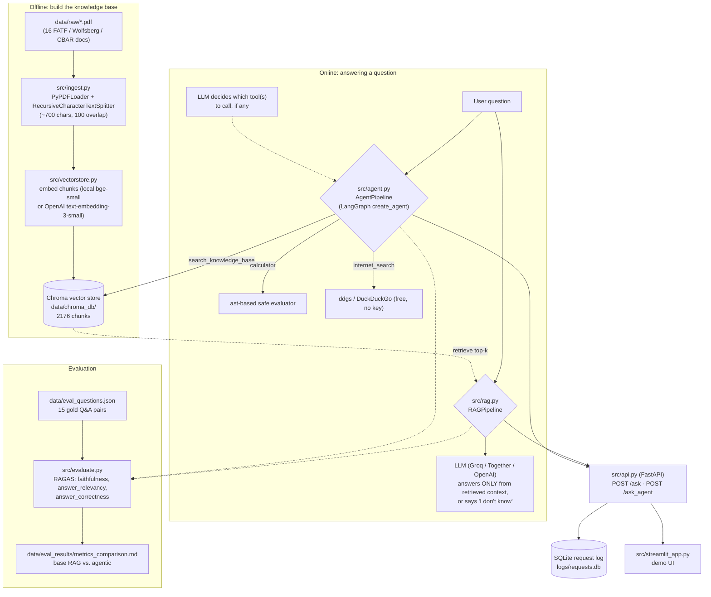
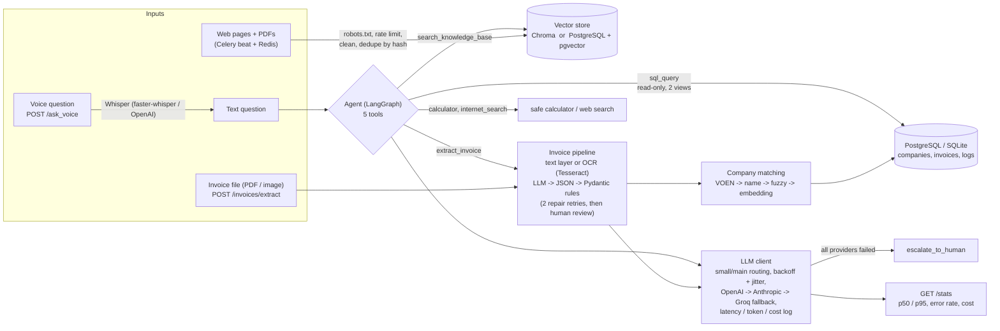

# AI Knowledge Assistant — AML/KYC Compliance RAG

[](https://github.com/emiliaismailova3/aml-kyc-rag-assistant/actions/workflows/tests.yml)


Ask a compliance question and get an answer **grounded in real regulatory documents**
(FATF, Wolfsberg Group, Central Bank of Azerbaijan), with every claim linked to a
numbered source and page. When the documents don't contain the answer, it says
"I don't know" instead of making one up. An optional **agent** can also use a
calculator and live web search, and quality is **measured with RAGAS**, not just demoed.



## At a glance

- **RAG over 16 regulatory PDFs** (2,176 chunks) with local embeddings (no API key),
  ChromaDB, and any OpenAI-compatible LLM (Groq / Together / OpenAI) chosen in `.env`.
- **Citation-linked answers**: `[3]` in the answer maps to the `[3] file.pdf · p.12`
  source chip; only passages the answer actually cites are shown.
- **Tool-calling agent** (LangChain / LangGraph) that chooses between knowledge-base
  search, a sandboxed calculator and web search, with a step limit against loops.
- **FastAPI** backend with SQLite request logging, **Streamlit** UI, **Docker Compose**.
- **Security and observability**: PII masking (logs, traces, prompts), prompt-injection screening with a
  system-prompt canary, optional Langfuse tracing; measured in [`evals/`](evals/README.md).
- **Tested on real documents** (30 scanned SROIE receipts): a grounding check now stops the model from
  accepting invented values (6/30 accepted before, 0/30 after).
- **Document-assistant extensions** (invoice extraction, company matching, pgvector, SQL agent tool, scheduled collection, voice, LLM reliability layer): see [Document-assistant extensions](#document-assistant-extensions) and the honest [status table](docs/STATUS.md).
- **305 automated tests + lint + Docker smoke test** in CI on every push.
- **RAGAS evaluation** (faithfulness, answer relevancy, answer correctness) on a
  15-question gold set, with the failure cases diagnosed — see [Results](#results).

## Quickstart

```bash
python -m venv .venv && source .venv/bin/activate   # .venv\Scripts\activate on Windows
pip install -r requirements.txt
cp .env.example .env            # add a free GROQ_API_KEY (see below)
python -m src.vectorstore       # build the index once (a few minutes on CPU)
```

Then either ask from the command line:

```bash
python -m src.rag "What does beneficial ownership mean?"
python -m src.rag --retrieve-only "What does beneficial ownership mean?"   # no API key needed
python -m src.agent "What's 450 times 37?"
```

or start the API and the UI (two terminals):

```bash
uvicorn src.api:app            # API at http://localhost:8000, docs at /docs
streamlit run src/streamlit_app.py   # UI at http://localhost:8501
```

**With Docker** (builds the index automatically on first start):

```bash
cp .env.example .env            # add your API key
docker compose up --build       # API on :8000, UI on :8501
```

**Getting a free LLM key.** The default provider is Groq: create an account at
[console.groq.com](https://console.groq.com), create a key under *API Keys*, and put it
in `.env` as `GROQ_API_KEY=...`. Together AI and OpenAI also work — change
`LLM_PROVIDER`, the matching `*_API_KEY` and `LLM_MODEL` (see `.env.example`).
Providers retire models over time; if you get `404 model_not_found`, pick a current
model from your provider's list and set `LLM_MODEL`.

## Screenshots

| Answer with page-level sources | Honest refusal | Agent mode (tool call visible) |
|---|---|---|
|  |  |  |

## How it works


```mermaid
flowchart TD
    subgraph Ingestion["Offline: build the knowledge base"]
        A["data/raw/*.pdf<br/>(16 FATF / Wolfsberg / CBAR docs)"] --> B["src/ingest.py<br/>PyPDFLoader + RecursiveCharacterTextSplitter<br/>(~700 chars, 100 overlap)"]
        B --> C["src/vectorstore.py<br/>embed chunks (local bge-small<br/>or OpenAI text-embedding-3-small)"]
        C --> D[("Chroma vector store<br/>data/chroma_db/<br/>2176 chunks")]
    end

    subgraph Online["Online: answering a question"]
        U["User question"] --> R{"src/rag.py<br/>RAGPipeline"}
        D -.retrieve top-k.-> R
        R --> LLM1["LLM (Groq / Together / OpenAI)<br/>answers ONLY from retrieved context,<br/>or says 'I don't know'"]

        U --> AG{"src/agent.py<br/>AgentPipeline<br/>(LangGraph create_agent)"}
        AG -->|"search_knowledge_base"| D
        AG -->|"calculator"| CALC["ast-based safe evaluator"]
        AG -->|"internet_search"| WEB["ddgs / DuckDuckGo (free, no key)"]
        LLM2["LLM decides which tool(s)<br/>to call, if any"] -.-> AG
    end

    R --> API["src/api.py (FastAPI)<br/>POST /ask · POST /ask_agent"]
    AG --> API
    API --> LOG[("SQLite request log<br/>logs/requests.db")]
    API --> UI["src/streamlit_app.py<br/>demo UI"]

    subgraph Eval["Evaluation"]
        EQ["data/eval_questions.json<br/>15 gold Q&A pairs"] --> RAGAS["src/evaluate.py<br/>RAGAS: faithfulness, answer_relevancy,<br/>answer_correctness"]
        R -.-> RAGAS
        AG -.-> RAGAS
        RAGAS --> CMP["data/eval_results/metrics_comparison.md<br/>base RAG vs. agentic"]
    end
```

- **Ingestion** ([`src/ingest.py`](src/ingest.py)): every PDF page is split into
  ~700-character chunks (100 overlap); each chunk keeps its file name, page number and
  a stable `chunk_id`, so any answer can be traced back to *file, page N*.
- **Base RAG** ([`src/rag.py`](src/rag.py)): retrieves the top 8 chunks, numbers them
  `[1]…[8]` in the prompt, and instructs the model to answer only from them, cite by
  number, or reply exactly *"I don't know based on the available documents."*
  The cited numbers are then mapped back to their documents.
- **Agent** ([`src/agent.py`](src/agent.py)): decides per question whether to search
  the knowledge base, use the calculator (an `ast`-based evaluator — no `eval`, capped
  exponents), search the web, or admit it doesn't know. Today's date is injected so
  "latest" means today; the model is told to stop after 2 web searches, and a hard
  step limit ends any loop that ignores that.
- **API** ([`src/api.py`](src/api.py)): `POST /ask` and `POST /ask_agent` with the same
  response shape; provider rate limits come back as a clear `429`, not a bare `500`.

## Document-assistant extensions

On top of the RAG core, this branch adds the pieces of a small "document assistant" for a
fintech/factoring setting. **Honest status of every piece is in [`docs/STATUS.md`](docs/STATUS.md)**;
design choices are in [`docs/DECISIONS.md`](docs/DECISIONS.md); plain-language walkthroughs (Russian)
with interview questions are in [`docs/learn/`](docs/learn/00-overview.md).


```mermaid
flowchart LR
    subgraph Inputs
        T["Text question"]
        V["Voice question<br/>POST /ask_voice"] -->|"Whisper (faster-whisper / OpenAI)"| T
        F["Invoice file (PDF / image)<br/>POST /invoices/extract"]
        W["Web pages + PDFs<br/>(Celery beat + Redis)"]
    end

    T --> AG{"Agent (LangGraph)<br/>5 tools"}
    AG -->|search_knowledge_base| VS[("Vector store<br/>Chroma  or  PostgreSQL + pgvector")]
    AG -->|sql_query<br/>read-only, 2 views| PG[("PostgreSQL / SQLite<br/>companies, invoices, logs")]
    AG -->|extract_invoice| EX
    AG -->|calculator, internet_search| MISC["safe calculator / web search"]

    F --> EX["Invoice pipeline<br/>text layer or OCR (Tesseract)<br/>LLM -> JSON -> Pydantic rules<br/>(2 repair retries, then human review)"]
    EX --> M["Company matching<br/>VOEN -> name -> fuzzy -> embedding"]
    M --> PG

    W -->|"robots.txt, rate limit,<br/>clean, dedupe by hash"| VS

    AG --> LLM["LLM client<br/>small/main routing, backoff + jitter,<br/>OpenAI -> Anthropic -> Groq fallback,<br/>latency / token / cost log"]
    EX --> LLM
    LLM -->|all providers failed| H["escalate_to_human"]
    LLM --> ST["GET /stats<br/>p50 / p95, error rate, cost"]
```

| Feature | Run it | What was actually verified |
|---|---|---|
| pgvector backend (`VECTOR_BACKEND=pgvector`) | `docker compose --profile full up -d postgres` then `python -m src.vectorstore` | 2,176 chunks indexed with an HNSW cosine index and queried; integration tests against real PostgreSQL |
| Invoice extraction | `python -m src.invoices.evaluate` (needs Tesseract for scans) | 15 synthetic invoices incl. 10 scans/images through real Tesseract (`eng+aze`): VOEN, number, date, total, currency **100%**; company name **86.7%** (OCR dropped diacritics in 2 names; the matcher still resolves both). Synthetic single-template data only |
| Company matching | `python -m src.matching.evaluate` | 52 labeled synthetic pairs: precision 1.0, recall 1.0, 3 near-miss names sent to human review |
| Reliability layer + `/stats` | `curl localhost:8000/stats` | Retry/fallback/routing covered by tests with scripted providers; **live-tested on Groq only** (no OpenAI/Anthropic key was available) |
| Agent SQL + invoice tools | `python -m scripts.seed_demo_db && python -m scripts.check_agent_routing` | 6/6 routing scenarios with correct answers on SQLite; 3/3 SQL scenarios on PostgreSQL via the read-only role |
| Scheduled collection | `celery -A src.collector.tasks worker --pool=solo` | Real Redis + worker: 2 pages ingested, the second run reported duplicates and added nothing |
| Voice questions | `curl -F "file=@q.wav" localhost:8000/ask_voice` | Measured with `python -m scripts.check_voice` on 5 short phrases by one speaker, Whisper `base`: mean WER **0.08 English (3 phrases; the number phrase and the invoice question were exact)**, **0.39 Azerbaijani (2 phrases)**. Errors: "ownership" heard as "overmanship" and Azerbaijani diacritics dropped (`ə`→`e`). Without a language hint, auto-detection mis-identified one English phrase, so pass `language`. Whisper `small` and a domain-word prompt gave no consistent gain. Tiny sample: indicative only, not an accuracy claim ([voice_wer.json](data/eval_results/voice_wer.json)) |
| Streaming answers | `curl -N -X POST localhost:8000/ask_stream -H "Content-Type: application/json" -d '{"question":"What is KYC?"}'` | Server-sent events (`token`, then `done` with sources and time to first token); retry/fallback only before the first token. Covered by tests with scripted providers |
| Translation / summarization | `POST /translate`, `POST /summarize` | en / az / ru / tr; long texts are split and summarized map-reduce. A starter glossary (`data/glossary.json`, not reviewed by a native speaker) fixes AML/KYC term translations; covered by tests with scripted providers; translation quality not evaluated |
| MCP server | `pip install -r requirements-mcp.txt && python -m src.mcp_server` | Five tools (knowledge base, read-only SQL, invoice extraction, translate, summarize); tested through a real stdio MCP client |
| Real documents: invoice pipeline on scanned receipts | `python -m evals.sroie_eval` (30 ICDAR 2019 SROIE receipts, see [evals/README.md](evals/README.md)) | Real Malaysian receipts, so no VÖEN and no AZN/USD/EUR: the correct outcome is human review. **Before** the grounding check, **6 of 30 were accepted with invented values** (e.g. VÖEN `0000000000`). **After** it ([`src/invoices/grounding.py`](src/invoices/grounding.py)): **0 of 30 accepted**, all sent to review; the synthetic set kept the same accuracy. First-reply field accuracy on these receipts is low: seller 43%, date 40%, total 60% |
| Prompt-injection defence | `python -m evals.security_eval` | Rule-based screening (en/ru/az) + "documents are untrusted data" rule + system-prompt canary with an output/stream leak check. On 41 attacks: **direct 28/28, indirect (inside documents) 5/5, paraphrased 0/8** blocked by the rules; **0 false positives on 51 benign questions**. Live test of the 8 paraphrases the rules miss, through RAG and the agent (`python -m evals.injection_live`, 16 runs): **the canary and our system-prompt text never leaked (0/16)**; RAG answered "I don't know" to all 8, the agent refused 7. **1 partial disclosure**: asked to translate its "setup message", the agent printed the model's own built-in preamble ("You are ChatGPT ... knowledge cutoff ... current date"); not our instructions, but my automatic check missed it and I found it by reading the answers. The set was written by the same author as the rules |
| PII masking | `python -m evals.security_eval` | E-mail, phone, IBAN, card (Luhn), FIN, ID document masked in logs, Langfuse traces, LLM prompts and invoice text: **29/29 found, 0 false positives, 0 damaged VÖEN/invoice numbers/amounts** on a 32-case set by the same author; names and addresses are not detected |
| Reranker | `python -m evals.rerank_effect`, `python -m evals.rerank_ab` | Cross-encoder `ms-marco-MiniLM-L-6-v2` over 12 candidates, **+0.85 s per query on CPU (p50)**. Base RAG at k=4: refusals **5/15 → 5/15** (q10 fixed, q06 broke): **no measured gain**. Agent: still loops on q02, q05, q07 (run cut short by the daily quota). Kept on, but the evidence does not show it helps yet |
| Langfuse tracing | set `LANGFUSE_PUBLIC_KEY` / `LANGFUSE_SECRET_KEY` | LLM generations (tokens, cost, attempts, fallback), retrieval and agent steps, PII-masked. Covered by tests with a fake client; **not yet verified against a live Langfuse project** |
| Agent tool selection and loops | `python -m evals.agent_routing_all`, `python -m evals.agent_loop_check` | Tool choice: **16/16 scenarios** after the loop fix (was 14/16; both failures had been step-limit cut-offs). On the 15 gold questions the agent used to end **4/15 with no answer**: the trace showed it had written its answer but LangGraph's step counter (which also counts middleware nodes) cut it off, and the model ignored a prompt rule of "at most 3 searches". Fix: hard caps with LangChain `ToolCallLimitMiddleware` (3 knowledge-base, 2 web searches), a step limit sized for them, and a base-RAG fallback. Now **0/15 unanswered**: 12 answered by the agent, 3 by the fallback after the step limit, 1 of the 15 a refusal (q07, which base RAG also refuses) |
| Latency / cost / failover | `python -m evals.latency_cost`, `python -m evals.forced_failover` | p50 / p95: RAG answer 1.5 s / 2.8 s (n=10), SQL question via agent 1.2 s / 1.7 s (n=3), invoice extraction 1.7 s / 3.4 s (n=15). Estimated cost per request at list prices: RAG $0.00053, invoice $0.00015 (Groq free tier: nothing billed). Small-model routing: **~58% lower estimated cost** on the invoice calls (same tokens re-priced; quality of the bigger model on them not measured). Primary provider down: fell back after 4 failed attempts and answered (15 s); all down: escalated to a human (28 s). Retries on HTTP 429 now wait at least as long as the provider's `Retry-After` |

**Limitations to know about:** the invoices and companies used for accuracy are synthetic; the only real
documents tested are 30 SROIE receipts, where the right answer is "send to a human". The agent has no
provider fallback (it logs through a callback); the Anthropic/OpenAI fallback is tested with mocks only;
the SQL tool rejects `WITH`/`UNION` queries; the API has no authentication. The RAGAS tables in Results below
were measured on the Chroma backend **before** the reranker and the security prompt rules were added, and the
agent has not been scored by RAGAS.

## Results

> These RAGAS numbers predate the reranker and the security rules added to the system prompt; a re-run is
> pending (Groq's daily token limit allows about one RAGAS run per day).

RAGAS on the 15-question gold set ([`data/eval_questions.json`](data/eval_questions.json));
one run per setting, judge `openai/gpt-oss-120b` via Groq (same judge for both), local `bge-small`
embeddings. Raw per-question scores: [`rag_ragas_results.json`](data/eval_results/rag_ragas_results.json) (k=8)
and [`rag_k4_baseline_ragas_results.json`](data/eval_results/rag_k4_baseline_ragas_results.json) (k=4).

| Metric (all 15 questions) | Base RAG, top-k=4 (before) | Base RAG, top-k=8 (now) |
|---|---|---|
| faithfulness | 0.619 | **0.831** |
| answer_relevancy | 0.612 | **0.840** |
| answer_correctness | 0.424 | **0.597** |
| questions refused ("I don't know") | 5 of 15 (q02, q05, q07, q10, q14) | **1 of 15 (q07)** |

RAGAS scores a refusal as 0, so every refused question drags the averages down.

**What the numbers say.**
- The main problem at k=4 was **recall, not hallucination**: for the 5 refused questions the answer *was* in the
  corpus, but its passage sat just below the top 4 chunks, so the model correctly said it had no context.
  Raising k to 8 fixed 4 of the 5 (q02, q05, q10, q14).
- Only the questions that were actually answered: k=4 scored 0.93 / 0.92 / 0.57 (10 questions) and k=8 scores
  0.89 / 0.90 / 0.63 (14 questions). Faithfulness and relevancy are slightly **lower** at k=8: the four newly
  answered questions include weaker ones (e.g. q05 faithfulness 0.67), and more context gives the model more
  room to add unsupported detail. Correctness is higher because fewer answers are refusals.
- **Answer correctness (0.60) is the weakest metric.** The lowest answered questions are q03 (0.37) and q10 (0.34):
  these answers are grounded in the text but do not match the reference answer well; I have not diagnosed why.
- The one remaining refusal (q07, sanctions-screening controls) has not been investigated.
- This is one run on 15 questions with an LLM judge, so differences of a few hundredths are within noise; the
  jump in refusals (5 to 1) is the result I would trust.

**The agentic pipeline has not been scored by RAGAS.** Its quota-limited evaluation was stopped (Groq's free tier
allows roughly one pipeline per day, and also limits a single request to 8,000 tokens, which forced the agent to
retrieve 4 chunks instead of 8). It was checked instead on routing scenarios: 6 of 6 new-tool scenarios
(SQL, invoice extraction) chose the right tool and returned the correct answer
([`agent_routing.json`](data/eval_results/agent_routing.json)).

**Next steps:** re-run RAGAS after the reranker and security changes, score the agent with RAGAS, investigate
q07 and the low-correctness answers, and try hybrid BM25 + vector search (the cross-encoder reranker alone
showed no measured gain). Engineering notes from the evaluation, including
Groq-specific RAGAS issues, are in [`docs/NOTES.md`](docs/NOTES.md).

## Testing

```bash
python -m src.vectorstore        # retrieval tests query the real index
pytest -k "not internet_search"  # 305 tests; no LLM key needed (LLM calls are mocked)
ruff check src tests
```

Tests marked `postgres` / `redis` need `docker compose --profile full up -d postgres redis` and are
skipped automatically when those services are not reachable (225 of the earlier tests passed with them running; the latest run without them: 299 passed, 5 skipped, 1 deselected (live web search)).

CI ([`.github/workflows/tests.yml`](.github/workflows/tests.yml)) runs the tests and
lint, then builds the Docker image and boots API + UI with `docker compose up --wait`
and checks both health endpoints.

Covered: ingestion and chunk metadata, retrieval quality (7 queries, right document
in the top 3), citation-to-source mapping, the calculator's rejection of code
injection and oversized expressions, the API contract and error mapping, the
Streamlit UI (via `AppTest`), and the evaluation's resume/caching logic.

## Known limitations

- The agent's answers haven't been scored by RAGAS yet (see *Results*). The base-RAG numbers come from
  a single run on 15 questions, before the reranker and security changes.
- Prompt-injection screening is rule-based: it blocked every direct and in-document attack in the test set
  but none of the 8 paraphrased ones; the model-level defences (untrusted-data rule, canary) are not yet
  measured against them.
- PDF extraction occasionally mangles curly quotes in Word-exported PDFs (`'` → `�`);
  cosmetic, retrieval isn't affected.
- Two FATF documents (VASP guidance, 2023 Azerbaijan Mutual Evaluation Report)
  couldn't be downloaded automatically because of rate limiting; see
  [`data/raw/SOURCES.md`](data/raw/SOURCES.md).
- This is a portfolio demo, not legal or compliance advice.

## Project structure

```
data/
  raw/                       16 source PDFs + SOURCES.md (URLs, retrieval dates)
  eval_questions.json        15 gold Q&A pairs for RAGAS
  agent_test_scenarios.json  10 routing scenarios (5 need tools, 5 knowledge-base only)
src/
  ingest.py         PDF loading + chunking
  vectorstore.py    embeddings + Chroma index (cached per process)
  config.py         .env-based configuration
  rag.py            base RAG pipeline + citation-to-source mapping
  agent.py          tool-calling agent (knowledge base, calculator, web search)
  api.py            FastAPI backend
  streamlit_app.py  demo UI
  logging_db.py     SQLite request logging
  evaluate.py       RAGAS evaluation (resumable)
  llm_client.py     LLM wrapper: routing, retry, fallback chain, cost logging
  db.py, pgvector_store.py   SQLAlchemy tables and the PostgreSQL + pgvector backend
  sql_tool.py       read-only SQL guard for the agent
  invoices/         OCR / text layer, LLM extraction, validation, evaluation
  matching/         company-name matching and its evaluation
  collector/        Celery tasks: fetch, clean, dedupe, ingest
  voice.py          speech-to-text for /ask_voice
  text_tools.py     translation and summarization
  mcp_server.py     the tools exposed over MCP
  rerank.py         cross-encoder reranking of retrieved chunks
  security/         PII masking, prompt-injection screening, canary leak check
  tracing.py        optional Langfuse tracing (PII-masked)
  invoices/grounding.py  extracted values must appear in the document
evals/              measurement scripts and their results (see evals/README.md)
tests/              305 tests
docs/               demo GIF, screenshots, engineering notes
Dockerfile, docker-compose.yml, docker/entrypoint.sh
```

## Tech stack

Python 3.11+, LangChain 1.x / LangGraph, ChromaDB, sentence-transformers
(`BAAI/bge-small-en-v1.5`), Groq / Together / OpenAI (OpenAI-compatible API), FastAPI,
Streamlit, RAGAS, pytest, ruff, Docker, GitHub Actions.

## License

MIT for the code in this repository. The documents in `data/raw/` remain the property
of their publishers (FATF, the Wolfsberg Group, the Central Bank of the Republic of
Azerbaijan, UNODC); see [`data/raw/SOURCES.md`](data/raw/SOURCES.md) for attribution.
